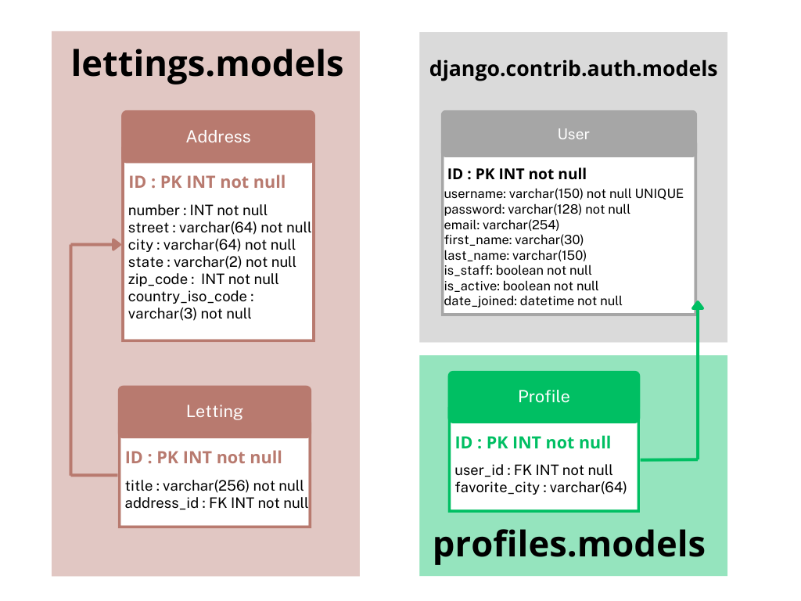

Structure et Modeles de la Base de Données
==========================================

Application "lettings" 
----------------------
L'application "lettings" définit deux modèles principaux dans la base de données.

1 Address : Ce modèle représente une adresse avec les champs suivants :

- number : Numéro de rue (entier positif).
- street : Nom de la rue.
- city : Nom de la ville.
- state : État (code ISO à deux caractères).
- zip_code : Code postal (entier positif).
- country_iso_code : Code ISO du pays (trois caractères).

2 Letting : Ce modèle représente une location avec les champs suivants :

- title : Titre de la location.
- address : Relation OneToOne avec le modèle Address, représentant l'adresse associée à la location.

Application "profiles"
----------------------

L'application "profiles" définit un modèle dans sa base de données.

Profile (Profil d'Utilisateur) : Ce modèle représente un profil d'utilisateur avec les champs suivants :
user : Relation OneToOne avec le modèle d'utilisateur de Django (User).
favorite_city : Ville préférée de l'utilisateur (chaîne de caractères, optionnelle).

La Class User
-------------

La classe User est fournie par Django et gère les informations d'authentification de l'utilisateur,
telles que le nom d'utilisateur, le mot de passe, etc.

Schéma UML
-----------

